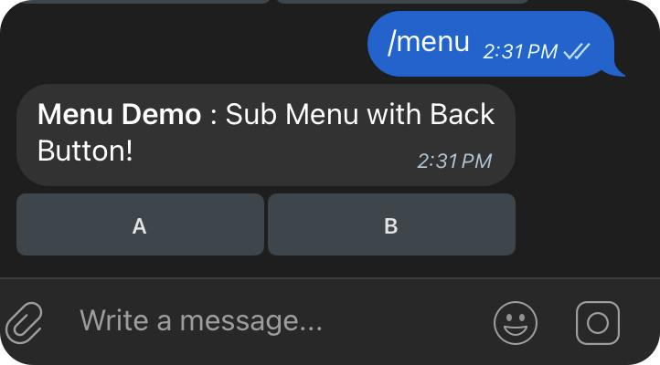
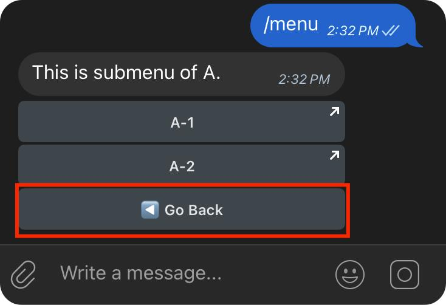

# TON Coding Challenge 2025

> 2025-03-28 活动已经结束，不再收集提交名单。

为了帮助大家快速掌握 TON 生态的开发技能，我们特别设计了有趣的编程入门挑战赛。快来参与并有机会赢取 Telegram Premium 大会员！详细的比赛规则请查看群组公告。

活动咨询群：https://t.me/TON_HongKong
技术答疑群：https://t.me/tondev_zh

> 如何参与？
> 
> Fork 本仓库的代码，回答下面的问题，然后发起一个 Pull Requests 就算成功参与。

---

## 任务 1：开发一个 bot 支持文本和命令消息回复 (30分)

### 任务描述：

1. 用户输入 wallet 或者 /wallet 后，bot 回复你的 TON 钱包地址
2. 用户输入 tg 或者 /tg 后，bot 回复你的 Telegram 用户名

### 答案和评分说明：

请写下你的 Bot username，如果你的 Bot 没有部署到线上，则同时提交对应的代码也可参与评分，根据代码完成度评分。

1. Bot username = ifoxbinBot
2. Wallet address =  -
3. Telegram username =  ifoxbin

   （ 你的 TON 钱包地址将用于接受 SBT，你的Telegram 用户名用于接受 Telegram Premium 会员奖励 ）
---

## 任务 2：实现一个二级菜单功能 (70分)

### 任务描述：

1. 通过 [Interactive Menus](https://grammy.dev/plugins/menu) 实现一个二级菜单
2. 用户输入 menu 或者 /menu 后，回复一个带有菜单的消息
3. 如图 1 所示，一级菜单有 A 和 B 两个按钮
4. 点击按钮 A，如图 2 所示，进入二级菜单，展示 A-1、A-2 和 Go Back 按钮
5. 点击 Go Back 按钮，返回到一级菜单

图 1 

图 2

### 答案和评分说明：

请写下你的 Bot username，如果你的 Bot 没有部署到线上，则同时提交对应的代码也可参与评分，根据代码完成度评分。

1. Bot username = ifoxbinBot

---

